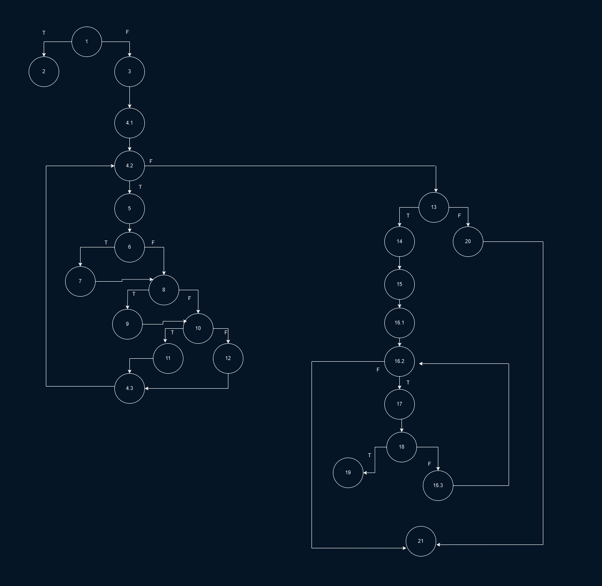

# SI_2025_lab2_236031
## Александар Димоски 236031

---

## 2) Control Flow Graph (CFG)


---

## 3) Цикломатска Комплексност
Цикломатската комплексност на функцијата checkCart е 9.

Се добива преку формулата: бројот на ребра - број на јазли + 2
```
28 - 21 + 2 = 9
```

---

## 4) Тест случаи според критериумот Every statement

За да се покријат сите наредби во `checkCart` доволни се следните пет тест-случаи:

| # | `allItems` состојба | `cardNumber` | Очекуван исход |
|---|---------------------|--------------|----------------|
| 1 | `null` | `"1234567890123456"` | **Exception** – *allItems list can't be null!* |
| 2 | `[ new Item("", 5, 10, 15) ]` | `"1234567890123456"` | **Exception** – *Invalid item!* (празно име) |
| 3 | `[ new Item("water", 50, 2, 0.1) ]` | `null` | **Exception** – *Invalid card number!* |
| 4 | `[ new Item("tea", 5, 10, 0.15) ]` | `"5296t59632458963"` | **Exception** – *Invalid character in card number!* |
| 5 | `[ new Item("tea", 2, 30, 25.0) ]` | `"5296859632458963"` | Валидна кошничка → вкупно = `2 × 30 – 30 = 30` |

Со овие пет случаи се посетуваат сите блокови од CFG-то.

---

## 5) Тест случаи според критериумот Multiple Condition

Во методот постои условот:
```
if (item.getPrice() > 300 || item.getDiscount() > 0 || item.getQuantity() > 10)
```


| Тест | `price > 300` | `discount > 0` | `quantity > 10` | Очекуван резултат                |
| ---- | ------------- | -------------- | --------------- | -------------------------------- |
| 1    | F             | F              | **T**           | се **одзема 30** (количина > 10) |
| 2    | **T**         | F              | F               | се **одзема 30** (цена > 300)    |
| 3    | F             | **T**          | F               | се **одзема 30** (попуст > 0)    |
| 4    | F             | F              | F               | **не** се одзема 30              |

Минималниот број тест-случаи за да се покријат сите можни комбинации на трите услови е 4

---
Тестовите ги извршив со JUnit и Gradle и истите поминаа успешно.